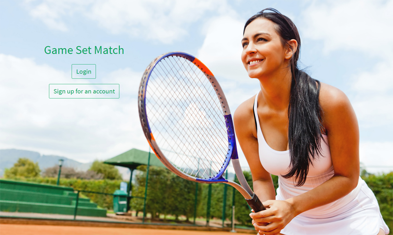

# :tennis: Game Set Match

The App for tennis enthusiasts

Game Set Match allows you to find a person with a similar proficiency level who is available to play in your area. You can enter multiple locations that you are comfortable commuting to, such as Home, Work, School, etc.

Like a personal diary for tennis, Game Set Match lets you record your match results including score, location, personal ratings and comments on games played.

You can view stats based on your games such as your win/loss record and total opponents.

## Technologies Used
- AngularJS
- Bootstrap
- CSS
- [Google Maps API](https://developers.google.com/maps/documentation/javascript/)
- To be used: [Google Calendar API](https://developers.google.com/google-apps/calendar/)

## Links
- Link to ["Game Set Match" front-end](https://github.com/lekova/game_set_match) source code on GihUb
- Link to ["Game Set Match" back-end](https://github.com/lekova/game_set_match_api) source code on GihUb
- Link to ["Game Set Match"](http://linalekova.com/game_set_match) hosted app
